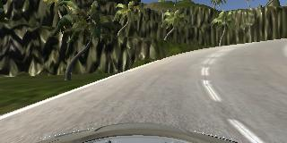
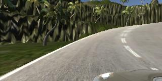
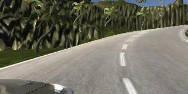
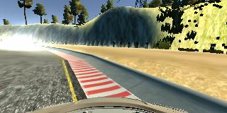

# Behavioral Cloning
[](http://www.udacity.com/drive)


This project belongs to my work towards Udacitys 'Self-Driving Car Engineer' Nanodegree. The general project goal is to train a deep neural network to imitate a human driver steering a car around a track. A more detailed description of the project goals can be found below.


## 1. The Project

The goals / steps of this project are the following:
* Use the simulator to collect data of good driving behavior
* Build, a convolution neural network in Keras that predicts steering angles from images
* Train and validate the model with a training and validation set
* Test that the model successfully drives around track one without leaving the road
* Summarize the results with a written report

The project structured is as follows:
* There are 3 **python** source files
 * `model.py`: this file trains the CNN
 * `drive.py`: this file can be called with a trained model as argument to provide the simulation during autonomous mode with steering commands (forked from udacity)
 * `video.py`: this file is a helper assembling several signle images to one video file (forked from udacity)
* The **folders** are structured as follows:
 * `data` contains images as well as csv files referencing the images and containing steering commands of several training runs
 * `videos` contains screenrecordings showing the whole vehicle for both tracks as well as an video from inside the vehicle driving around track 1 (necessary for the project submission)
* a few additional files 
 * `get_data.sh` a helper file, which can be used to copy the data used for training from my perdonal GitHub repo to the Udacity workspace
 * `model.h5` the fitted model
 * `architecture.png`, `architecture.svg` the model architecture as png and svg version
 * In addition the project contains this readme and a license file

The video called `video.mp4` shows track 1, where the network should work well on. Track 2 is an extra (and optional) challenge - this track is by far harder to master.

## 2. Train the model

### 2.1 Network Architecture

As a basis for the model, NVIDIAs End-to-End-Learning architecture was used (https://devblogs.nvidia.com/deep-learning-self-driving-cars/). The adapted architecture is shown in Fig. 2.1.


<figure>
 
 <figcaption>
 <p></p> 
 <p style="text-align: center;"> Fig. 2.1: Network architecture</p> 
 </figcaption>
</figure>
 <p></p>

As the image shows, the images were preprocessed through normalization and cropping (20 pixels from the bottom and 50 from the top). The cropping ensures, that the network has to learn only based on the relevant part of the images. After that, the model consits of 5 Convolution Layers, a Flatten Layer, 3 (hidden) Dense Layers and a single output node. All Convolution and Dense layers (besides the output - as we train a regression network!) use RELU activations ensuring, that nonlinear problems can be solved and that the model can be efficiently fitted (preventing vanishing gradients).


### 2.2 Training Data

To gain training data for each of the both tracks a full lap in each direction was recorded. As steering the vehicle succesfully on the road is really hard with keyboard inputs, several situations where the vehicle left the road had to be manually cutted out. In addition the training data provided by udacity and several samples showing the vehicle how to steer back to to the lane center were used.

In order to get a model that generalizes even better, each image (and its respective steering command) where flipped at a vertical axis. In addition the images of all 3 cameras were used. To take the disposal of the images into account the steering commands for images of left camera were increased by a correction factor of 0.2. For the right camera images the steering commands were decreased by the same amount. For the flipped versions, also the correction was flipped. 

As we found out, that most samples of this large bunch contained examples, where no steering is neccessary, we decided to use only a small amount of images with a desired steering of 0.0:
* approx each 100 center image
* no images from left and right cameras
* no flipped images

Overall the data used to train our model has a high variety and therefore ensures a good generalization. The overall sample size is 64902, where 80% are used to train and 20% to validate the model. Below some samples are visualized.

Fig 2.2 shows a sample collected with the center camera collected on track 2. Fig 2.3 and Fig 2.4 show the same situation as Fig 2.2 but recorded with a camera positioned a the left respectively the right side of the vehicle.

<figure>
 
 <figcaption>
 <p></p> 
 <p style="text-align: center;"> Fig. 2.2: Example Image Track 2 Center Camera</p> 
 </figcaption>
</figure>
 <p></p>
 
<figure>
 
 <figcaption>
 <p></p> 
 <p style="text-align: center;"> Fig. 2.3: Example Image Track 2 Left Camera</p> 
 </figcaption>
</figure>
 <p></p>
 
 <figure>
 
 <figcaption>
 <p></p> 
 <p style="text-align: center;"> Fig. 2.4: Example Image Track 2 Right Camera</p> 
 </figcaption>
</figure>
 <p></p>

Fig 2.5 shows an image that was used to teach the net especially to steer back to the lane center.

<figure>
 
 <figcaption>
 <p></p> 
 <p style="text-align: center;"> Fig. 2.5: Training image showing the net how to steer back to the center of the lane</p> 
 </figcaption>
</figure>
 <p></p>


### 2.3 Fit & Optimization

The model was fitted with the training data introduced above and adam optimizer. Thereby, the mechanism early stopping was used, which ensures, that the training is stopped before running into overfitting. In this case, the training was  stopped if 3 consecutive epochs did not decrease the validation loss. The maximum number epochs has nevertheless been set to 10 - even if it had not been necessary. Dropout normalization was also tested but could not show any improvements, as the models seems not to overfit in order of its bride variance of training data. 


### 2.4 Put it into Pratice!
The model was tested by running it through the simulator and ensuring that the vehicle could stay on the track. The model drives the vehicle succesfully around both tracks! This means, that the nets ability to generalize seems to be very good, as track 2 is even more challenging. Videos showing the car driving around the tracks can be found in the videos folder.


## 3. Additional Information about this repo (from Udacity)

### 3.1 Dependencies
This lab requires:

* [CarND Term1 Starter Kit](https://github.com/udacity/CarND-Term1-Starter-Kit)

The lab enviroment can be created with CarND Term1 Starter Kit. Click [here](https://github.com/udacity/CarND-Term1-Starter-Kit/blob/master/README.md) for the details.

The following resources can be found in this github repository:
* drive.py
* video.py
* writeup_template.md

The simulator can be downloaded from the classroom. In the classroom, we have also provided sample data that you can optionally use to help train your model.

### 3.2 Details About Files In This Directory (from Udacity)

#### 3.2.1 `drive.py`

Usage of `drive.py` requires you have saved the trained model as an h5 file, i.e. `model.h5`. See the [Keras documentation](https://keras.io/getting-started/faq/#how-can-i-save-a-keras-model) for how to create this file using the following command:
```sh
model.save(filepath)
```

Once the model has been saved, it can be used with drive.py using this command:

```sh
python drive.py model.h5
```

The above command will load the trained model and use the model to make predictions on individual images in real-time and send the predicted angle back to the server via a websocket connection.

Note: There is known local system's setting issue with replacing "," with "." when using drive.py. When this happens it can make predicted steering values clipped to max/min values. If this occurs, a known fix for this is to add "export LANG=en_US.utf8" to the bashrc file.

##### Saving a video of the autonomous agent

```sh
python drive.py model.h5 run1
```

The fourth argument, `run1`, is the directory in which to save the images seen by the agent. If the directory already exists, it'll be overwritten.

```sh
ls run1

[2017-01-09 16:10:23 EST]  12KiB 2017_01_09_21_10_23_424.jpg
[2017-01-09 16:10:23 EST]  12KiB 2017_01_09_21_10_23_451.jpg
[2017-01-09 16:10:23 EST]  12KiB 2017_01_09_21_10_23_477.jpg
[2017-01-09 16:10:23 EST]  12KiB 2017_01_09_21_10_23_528.jpg
[2017-01-09 16:10:23 EST]  12KiB 2017_01_09_21_10_23_573.jpg
[2017-01-09 16:10:23 EST]  12KiB 2017_01_09_21_10_23_618.jpg
[2017-01-09 16:10:23 EST]  12KiB 2017_01_09_21_10_23_697.jpg
[2017-01-09 16:10:23 EST]  12KiB 2017_01_09_21_10_23_723.jpg
[2017-01-09 16:10:23 EST]  12KiB 2017_01_09_21_10_23_749.jpg
[2017-01-09 16:10:23 EST]  12KiB 2017_01_09_21_10_23_817.jpg
...
```

The image file name is a timestamp of when the image was seen. This information is used by `video.py` to create a chronological video of the agent driving.

#### 3.2.2 `video.py`

```sh
python video.py run1
```

Creates a video based on images found in the `run1` directory. The name of the video will be the name of the directory followed by `'.mp4'`, so, in this case the video will be `run1.mp4`.

Optionally, one can specify the FPS (frames per second) of the video:

```sh
python video.py run1 --fps 48
```

Will run the video at 48 FPS. The default FPS is 60.


